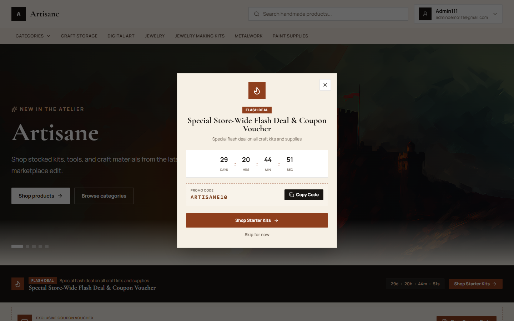
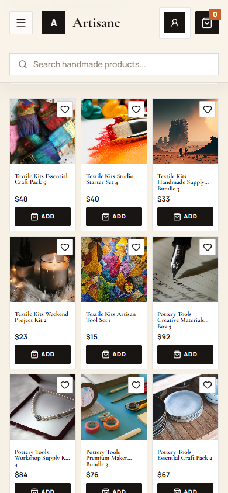
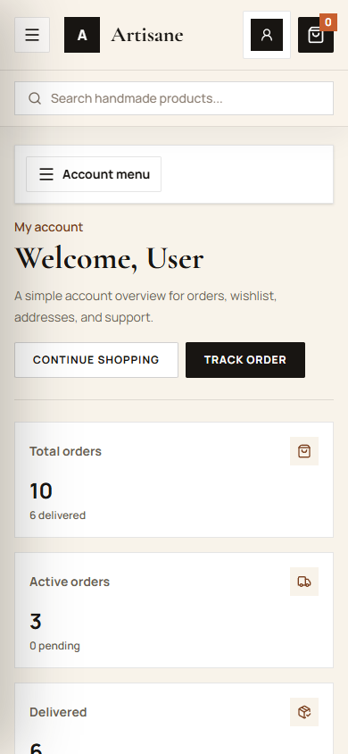
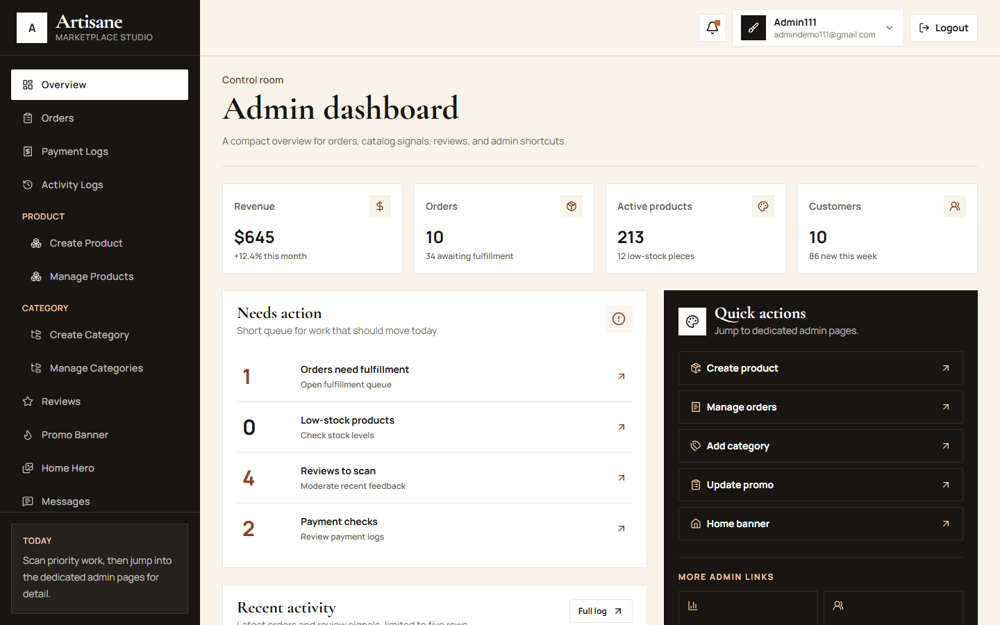
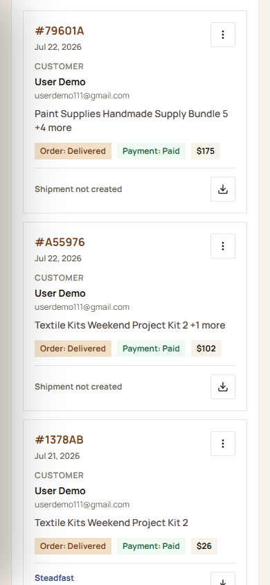

# Artisane Client

Artisane Client is the React storefront and dashboard UI for the Artisane ecommerce platform. It supports public shopping, customer account tools, admin operations, and super-admin user management.

Built with React 19, TypeScript, Vite, Redux Toolkit Query, Tailwind CSS, React Router, React Hook Form, Zod, Sonner, and Lucide icons.

## Screenshots

### Storefront



### Mobile Product Catalog

Compact ecommerce app style product cards, with 3-column mobile product grid.



### Customer Dashboard

Customer overview for orders, wishlist, profile, addresses, reviews, and support.



### Admin Dashboard

Compact admin overview. Dedicated pages hold deeper operational data.



### Admin Orders On Mobile

Admin tables become stacked record cards on mobile and tablet.



## Main Features

- Public storefront home, category browsing, product catalog, product detail pages, search, cart, promo content, and info pages.
- Customer checkout with saved addresses, district and zone selection, payment method choice, order confirmation, and payment result pages.
- Customer dashboard for overview, orders, order detail, wishlist, reviews, profile, addresses, and support.
- Admin dashboard for order, product, category, review, promo banner, home hero, payment log, activity log, analytics, messages, and settings areas.
- Super-admin user management page for user records, role/status edits, deletion, and account stats.
- Role-aware routing for guest, customer, admin, and super admin.
- Responsive UI with mobile product cards and admin record-card views for table-heavy pages.
- Steadfast shipment UI visible to admins, with real shipment creation restricted to super admins.
- PDF invoice download from admin order rows.

## Tech Stack

- `react` and `react-dom`
- `typescript`
- `vite`
- `@reduxjs/toolkit` and RTK Query
- `react-redux`
- `react-router-dom`
- `react-hook-form`
- `zod`
- `tailwindcss`
- `lucide-react`
- `sonner`

## Requirements

- Node.js 24 or compatible modern Node runtime
- npm
- Artisane backend running locally or deployed

Default API target:

```env
VITE_API_BASE_URL=http://localhost:5000/api/v1
```

Optional Google login:

```env
VITE_GOOGLE_CLIENT_ID=your-google-client-id
```

## Setup

```bash
npm install
```

Create `.env.local` when API URL differs from default:

```env
VITE_API_BASE_URL=http://localhost:5000/api/v1
VITE_GOOGLE_CLIENT_ID=
```

Start dev server:

```bash
npm run dev
```

Open:

```text
http://localhost:5173
```

## Available Scripts

```bash
npm run dev
```

Run Vite dev server on `0.0.0.0`.

```bash
npm run build
```

Type-check and build production assets.

```bash
npm run lint
```

Run ESLint across the project.

```bash
npm run lint:ox
```

Run Oxlint.

```bash
npm run format
```

Format files with Prettier.

```bash
npm run preview
```

Preview production build.

## Demo Login

Demo buttons are available on the login page.

Customer demo:

```text
Email: userdemo111@gmail.com
Password: user111
```

Admin demo:

```text
Email: admindemo111@gmail.com
Password: admin111
```

Super-admin credentials are seeded from backend environment variables and should not be committed to this client repository.

## Role Access

Guest:

- Home
- Categories
- Products
- Product detail
- Login and register
- Info pages

Customer:

- Customer dashboard
- Checkout
- Orders and order detail
- Wishlist
- Reviews
- Profile
- Addresses
- Support

Admin:

- Admin dashboard
- Orders and order detail
- Product management
- Category management
- Review moderation
- Promo banner
- Home hero
- Payment logs
- Activity logs
- Analytics
- Maintenance pages

Super admin:

- All admin access
- User management
- Real courier shipment creation

## Important Routes

Public:

```text
/
/categories
/products
/products/:id
/about
/faq
/shipping-returns
/terms
/privacy
```

Customer:

```text
/checkout
/dashboard
/dashboard/orders
/dashboard/orders/:id
/dashboard/wishlist
/dashboard/reviews
/dashboard/profile
/dashboard/addresses
/dashboard/support
```

Admin:

```text
/dashboard/admin/orders
/dashboard/admin/orders/:id
/dashboard/products
/dashboard/products/create
/dashboard/categories
/dashboard/categories/create
/dashboard/admin/reviews
/dashboard/admin/promo
/dashboard/admin/home-hero
/dashboard/admin/payment-logs
/dashboard/admin/payment-logs/:ref
/dashboard/admin/activity-logs
/dashboard/admin/analytics
```

Super admin:

```text
/dashboard/users
```

## Project Structure

```text
src/
  assets/              Static images and local brand/payment assets
  components/          Shared UI, layout, route guards, loaders, cart, product pieces
  config/              API configuration
  features/            RTK Query API slices and feature state
  pages/               Route-level screens
  providers/           Redux provider
  redux/               Store and typed hooks
  styles/              Global Tailwind and app styling
  utils/               Display, invoice, price, and order helpers
docs/screenshots/      README screenshots
public/                Public static assets served as-is
```

## Backend Contract

The client expects the backend under `VITE_API_BASE_URL` with these API areas:

- `auth`
- `products`
- `categories`
- `orders`
- `wishlists`
- `reviews`
- `addresses`
- `locations`
- `promo`
- `home-content`
- `payment-logs`
- `activity-logs`
- `analytics`
- `users`

JWT auth data is stored in local storage under:

```text
artisane_access_token
artisane_refresh_token
artisane_user
```

## Responsive Notes

- Mobile catalog uses 3-column compact product cards.
- Product card metadata is reduced on mobile for scan speed.
- Catalog filters collapse into a mobile filter and sort panel.
- Checkout avoids horizontal overflow with `min-w-0`, wrapping, and stacked address cards.
- Admin table-heavy pages use mobile/tablet record cards below `lg`; desktop keeps full data tables.
- Dashboard sidebars collapse into drawer menus on small screens.

## Quality Checks

Before handoff:

```bash
npm run build
npm run lint
```

For focused UI checks, use Playwright against the local dev server and capture screenshots into `docs/screenshots` only when they are useful for documentation.

## Deployment

Build output is generated in `dist/`.

```bash
npm run build
npm run preview
```

The app includes `vercel.json`, so it can be deployed to Vercel. Configure `VITE_API_BASE_URL` in the deployment environment.

## Notes For Maintainers

- Do not commit real super-admin credentials.
- Keep screenshots small and purposeful; update them after visible UI changes.
- Prefer route guards and shared auth helpers over inline role checks.
- Keep admin overview compact; deep data belongs in dedicated admin pages.
- Keep mobile product cards dense and readable, especially at `360px`, `390px`, and `430px` widths.
